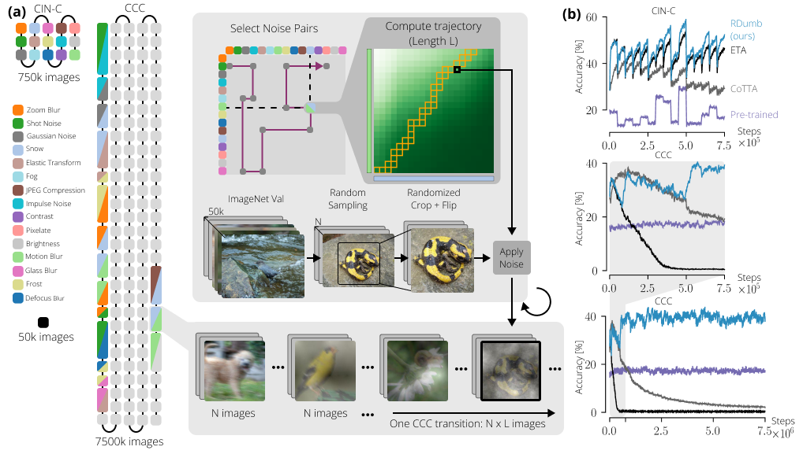

# RDumb: A simple approach that questions our progress in continual test-time adaptation



This repository contains the code used in our [paper](https://oripress.com/CCC.pdf) to evaluate models on our benchmark, ***Continuously Changing Corruptions (CCC)***.
Using CCC, we are able to show that all current TTA models fail and become worse than a
pretrained, non-adapting model. We show how a very simple baseline approach sets the state
of the art not just on CCC, but on previous benchmarks as well, as well as on different
architectures.


## Dataset (Continuously Changing Corruptions)

CCC can be thought of as ImageNet-C, specifically built to evaluate continuously adapting models.
Each image in CCC is noised using 2 noises. Using 2 noises, we can keep the baseline accuracy of the dataset constant,
while enabling smooth transitions between noises.


The code to generate the dataset can be found in ```generate.py```. The code is parallelizable, which means that the whole
dataset can be generated quickly.

For example, you start generating using the following script:


``` bash
python3 generate.py                  \
    --imagenetval /imagenet_dir/val/ \
    --dest /destination/folder/      \
    --baseline 40                    \
    --processind 1                   \
    --totalprocesses 1
```

To use more processes, simply run the script multiple times with different proccessind arguments. Because CCC is made up of 3 seeds x 3 transition speeds,
it is recommended to use a total number of processes that is a multiple of 9. Here is an example
Slurm script that can be used to launch multiple processes:

``` bash
#!/bin/bash
#SBATCH --job-name=ccc
#SBATCH --array=0-89

singularity exec gen.sif
python3 generate.py                     \
    --processind ${SLURM_ARRAY_TASK_ID} \
    --baseline 20                       \
    --totalprocesses 90                 \
    --imagenetval /path/to/imagenetval  \
    --dest /path/to/dest/
```


## Evaluating Adaptive Models

There a few TTA methods that are avaiable to test, including ours, E-ETA.
Because each difficulty level of CCC contains 3 speeds x 3 seeds, the evaluation code
is built to evaluate the 9 runs all at once. A sample evaluation can be ran in the following
manner:

``` bash
python3 eval.py                         \
    --mode eeta                         \
    --dset /path/to/ccc/                \
    --logs /logs/folder/                \
    --baseline 20                       \
    --processind ${SLURM_ARRAY_TASK_ID}
```


## Acknowledgements

Much of model code is based on the original [Tent](https://github.com/DequanWang/tent) and [EATA](https://github.com/mr-eggplant/EATA/) code.
The generation code is based on [ImageNet-C](https://github.com/hendrycks/robustness) code.
Other repos used: [RPL](https://github.com/bethgelab/robustness), [CPL](https://github.com/locuslab/tta_conjugate/), and [CoTTA](https://github.com/qinenergy/cotta).
A previous version of the dataset and code was published in [Shift Happens '22 @ ICML](https://github.com/shift-happens-benchmark/icml-2022).

See the [NOTICE](NOTICE) for more details and licenses.
